# Price Benchmark — Architecture & Logic Documentation

> Quick Commerce Assortment Tracker — Scrapes product data from Blinkit, Zepto, Swiggy Instamart, JioMart & Flipkart Minutes and provides a unified comparison dashboard.

---

## Table of Contents

- [System Overview](#system-overview)
- [High-Level Architecture](#high-level-architecture)
- [Request Flow](#request-flow)
- [Scraping Engine](#scraping-engine)
- [Frontend Architecture](#frontend-architecture)
- [Data Models](#data-models)
- [CSV Export Logic](#csv-export-logic)
- [File Structure](#file-structure)
- [Configuration](#configuration)
- [Platform-Specific Logic](#platform-specific-logic)

---

## System Overview

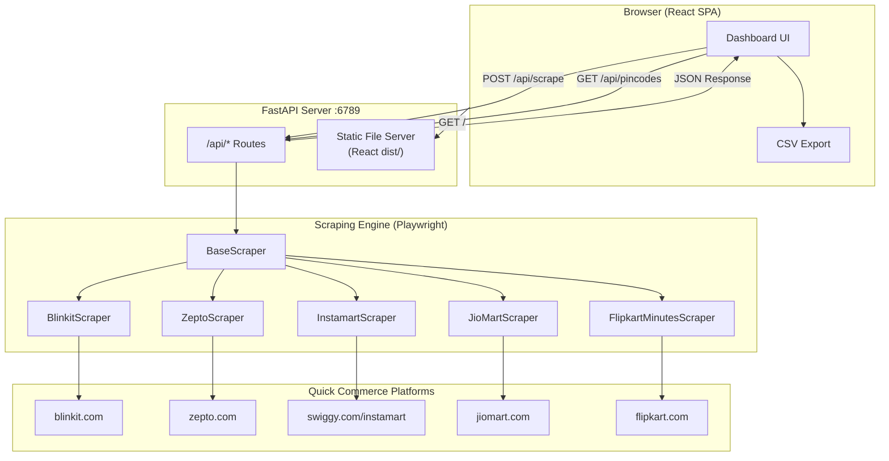

---

## High-Level Architecture

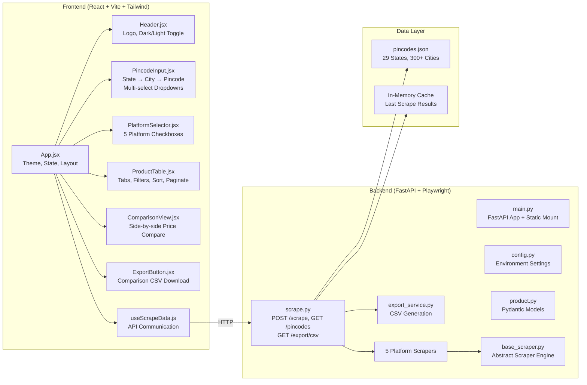

---

## Request Flow

### Scrape Flow (Main Feature)

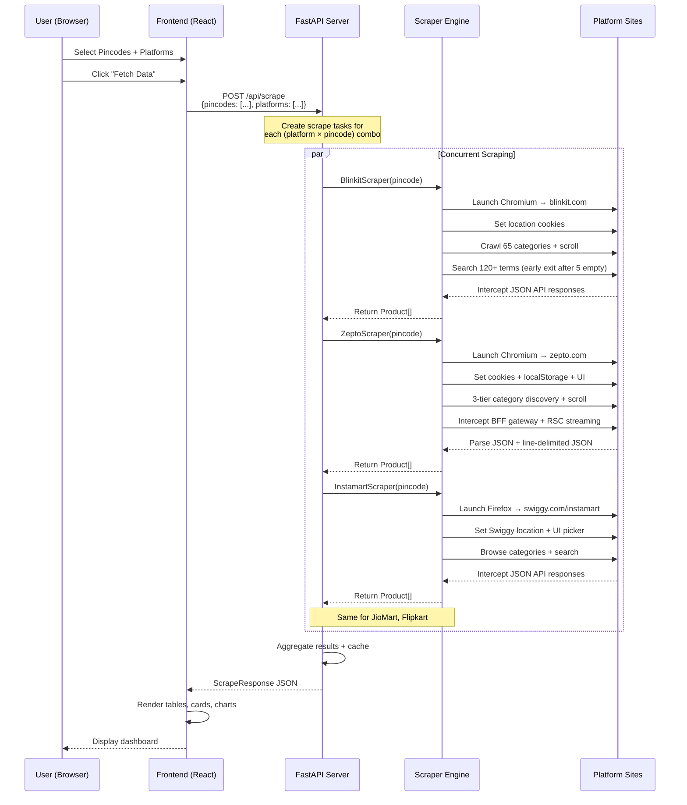

### Scraping Engine Detail

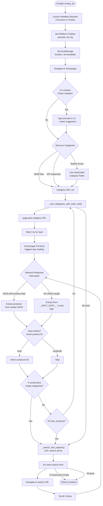

### Network Response Interception

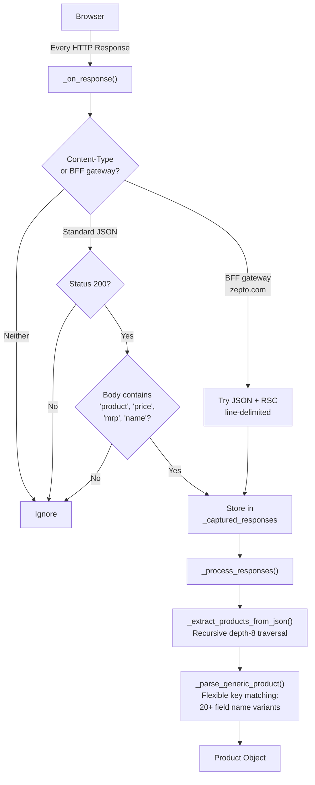

### Early Exit Strategy

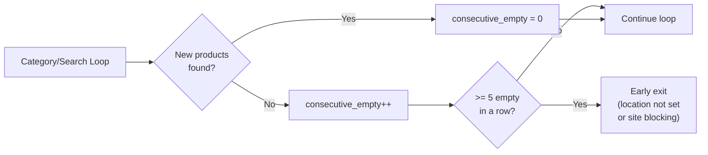

---

## Frontend Architecture

### Component Hierarchy

```mermaid
graph TD
    App["App.jsx<br/>─────────────<br/>• dark/light theme state<br/>• selectedPincodes[]<br/>• selectedPlatforms[]<br/>• view: table | compare<br/>• useScrapeData() hook"]

    App --> Header["Header.jsx<br/>─────────────<br/>• Gradient header bar<br/>• Dark/Light toggle button<br/>• Props: dark, onToggleTheme"]

    App --> PincodeInput["PincodeInput.jsx<br/>─────────────<br/>• State → City → Pincode<br/>  cascading dropdowns<br/>• Searchable dropdowns<br/>  (type to filter)<br/>• Multi-select with checkboxes<br/>• Manual pincode entry<br/>• Selected shown as tags<br/>• Uses usePincodes() hook"]

    App --> PlatformSelector["PlatformSelector.jsx<br/>─────────────<br/>• 5 platform checkboxes<br/>• Brand color indicators<br/>• Select All / Deselect All"]

    App --> ErrorBanner["ErrorBanner.jsx<br/>─────────────<br/>• Error (red) or Warning (amber)<br/>• Dismissible with ✕ button"]

    App --> LoadingSpinner["LoadingSpinner.jsx<br/>─────────────<br/>• Dual spinning rings<br/>• Platform name badges<br/>• Shows during scrape"]

    App --> SummaryCards["Summary Cards (inline)<br/>─────────────<br/>• Per-platform product count<br/>• Scrape duration<br/>• Total aggregation<br/>• 3-state: success / 0 amber / failed red<br/>• Shows error messages on failure"]

    App --> ViewToggle["View Toggle (inline)<br/>─────────────<br/>• Product Table view<br/>• Price Comparison view"]

    App --> ProductTable["ProductTable.jsx<br/>─────────────<br/>• Platform tabs with counts<br/>• Search, brand, pincode filters<br/>• Sortable columns<br/>• Pagination (25/page)<br/>• Color-coded platform badges"]

    App --> ComparisonView["ComparisonView.jsx<br/>─────────────<br/>• Groups products by name<br/>• Only shows items on 2+ platforms<br/>• Highlights cheapest in green<br/>• 'Lowest' label on best price"]

    App --> ExportButton["ExportButton.jsx<br/>─────────────<br/>• Downloads comparison CSV<br/>• Platform prices as columns<br/>• cheapest_platform column<br/>• price_diff column"]
```

### Theme System

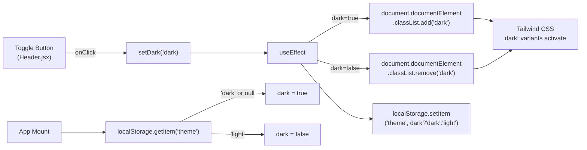

---

## Data Models

### Pydantic Models (Backend)

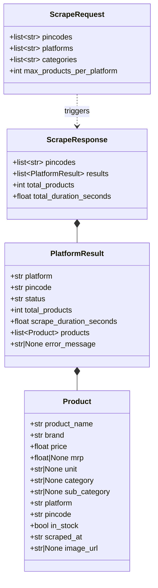

---

## CSV Export Logic

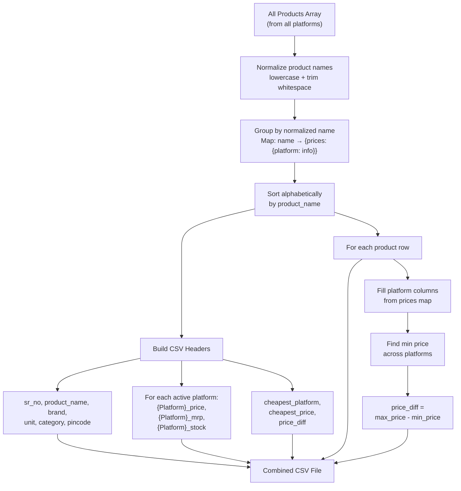

### CSV Output Example

```
sr_no | product_name    | brand | unit | Blinkit_price | Blinkit_stock | Zepto_price | Zepto_stock | cheapest_platform | cheapest_price | price_diff
1     | Amul Butter     | Amul  | 500g | 275.00        | Yes           | 279.00      | Yes         | Blinkit           | 275.00         | 4.00
2     | Lays Classic    | Lays  | 52g  | 20.00         | Yes           | 19.00       | Yes         | Zepto             | 19.00          | 1.00
3     | Tata Salt       | Tata  | 1kg  | 28.00         | Yes           |             |             | Tata              | 28.00          | 0.00
```

---

## File Structure

```
Price benchmark/
├── config.yaml                        # Central project configuration
├── ARCHITECTURE.md                    # This file
├── .gitignore
│
├── data/
│   └── pincodes.json                  # 29 states, 300+ cities, pincodes
│
├── backend/
│   ├── .env                           # Environment variables
│   ├── .env.example                   # Example env template
│   ├── requirements.txt               # Python dependencies
│   │
│   └── app/
│       ├── __init__.py
│       ├── main.py                    # FastAPI app + static file serving
│       ├── config.py                  # Settings from .env
│       │
│       ├── models/
│       │   ├── __init__.py
│       │   └── product.py             # Pydantic: Product, ScrapeRequest/Response
│       │
│       ├── routes/
│       │   ├── __init__.py
│       │   └── scrape.py              # API endpoints: /scrape, /pincodes, /export
│       │
│       ├── scrapers/
│       │   ├── __init__.py
│       │   ├── base_scraper.py        # Abstract base: browser, intercept, parse
│       │   ├── blinkit_scraper.py     # Blinkit: cookies + 65 categories + search
│       │   ├── zepto_scraper.py       # Zepto: cookies + localStorage + UI + search
│       │   ├── instamart_scraper.py   # Instamart: Swiggy location + categories + search
│       │   ├── jiomart_scraper.py     # JioMart: pincode cookie + categories + search
│       │   └── flipkart_minutes_scraper.py  # Flipkart: grocery search + categories
│       │
│       └── services/
│           ├── __init__.py
│           └── export_service.py      # Comparison-format CSV generation
│
└── frontend/
    ├── package.json                   # npm dependencies
    ├── vite.config.js                 # Vite: port 6789, API proxy
    ├── tailwind.config.js             # Tailwind: darkMode 'class', brand colors
    ├── postcss.config.js
    ├── index.html                     # Entry HTML
    │
    ├── src/
    │   ├── main.jsx                   # React DOM render
    │   ├── App.jsx                    # Root: theme, state, layout
    │   ├── index.css                  # Tailwind imports
    │   │
    │   ├── components/
    │   │   ├── Header.jsx             # Logo + dark/light toggle
    │   │   ├── PincodeInput.jsx       # State → City → Pincode multi-select
    │   │   ├── PlatformSelector.jsx   # Platform checkboxes
    │   │   ├── ProductTable.jsx       # Filterable, sortable, paginated table
    │   │   ├── ComparisonView.jsx     # Cross-platform price comparison
    │   │   ├── ExportButton.jsx       # CSV download trigger
    │   │   ├── LoadingSpinner.jsx     # Scrape progress indicator
    │   │   └── ErrorBanner.jsx        # Error/warning display
    │   │
    │   ├── hooks/
    │   │   └── useScrapeData.js       # POST /api/scrape + GET /api/pincodes
    │   │
    │   └── utils/
    │       ├── constants.js           # PLATFORMS array, API_BASE
    │       └── csvExport.js           # Client-side comparison CSV builder
    │
    └── dist/                          # Vite build output (served by FastAPI)
```

---

## Configuration

All settings are centralized in `config.yaml` (project root) and `backend/.env`.

See `config.yaml` for the complete reference of all configurable options.

---

## Platform-Specific Logic

### Blinkit

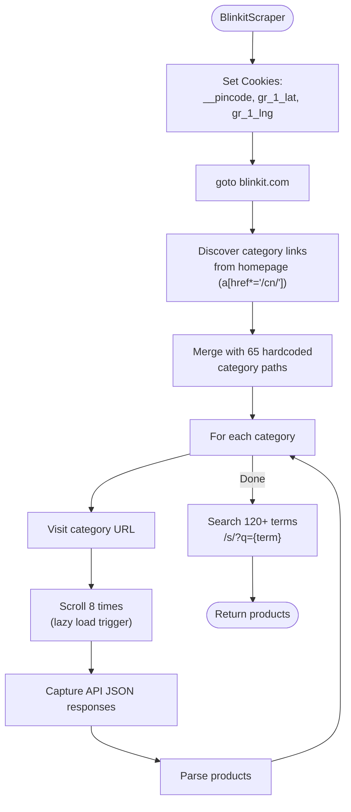

### Zepto

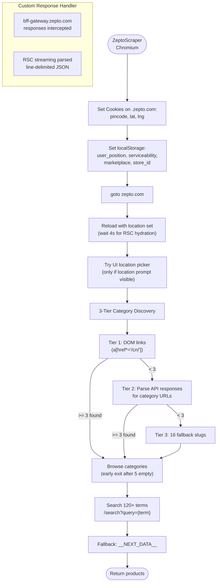

### Swiggy Instamart

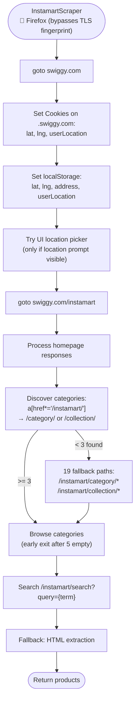

### JioMart

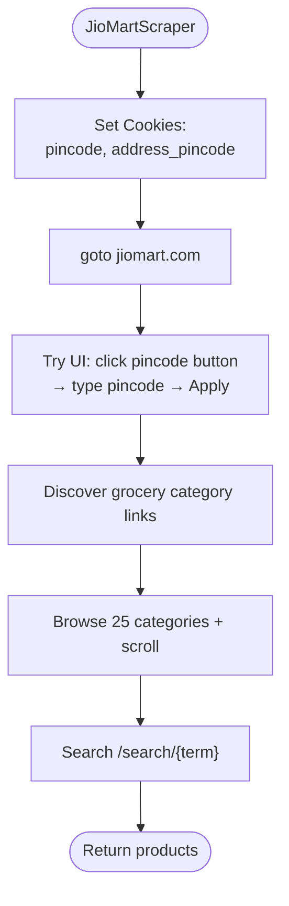

### Flipkart Minutes

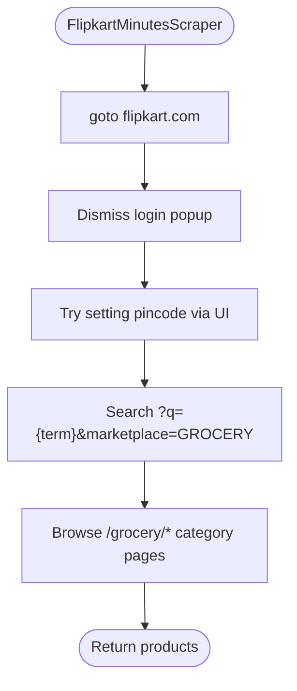

---

## Pincode → Coordinates Mapping

The scraper uses a **pincode prefix → lat/lng lookup table** to set correct location for each platform. This ensures that a Mumbai pincode shows Mumbai products, not Delhi.

```
Pincode prefix → City → (lat, lng)
────────────────────────────────────
11xxxx → Delhi     → (28.6139, 77.2090)
40xxxx → Mumbai    → (19.0760, 72.8777)
56xxxx → Bangalore → (12.9716, 77.5946)
50xxxx → Hyderabad → (17.3850, 78.4867)
60xxxx → Chennai   → (13.0827, 80.2707)
70xxxx → Kolkata   → (22.5726, 88.3639)
38xxxx → Ahmedabad → (23.0225, 72.5714)
41xxxx → Pune      → (18.5204, 73.8567)
... (80+ prefixes mapped)
```

---

## API Endpoints

| Method | Endpoint | Description |
|--------|----------|-------------|
| `POST` | `/api/scrape` | Scrape products for given pincodes × platforms |
| `GET` | `/api/pincodes` | Get state → city → pincode mapping |
| `GET` | `/api/export/csv` | Download comparison CSV |
| `GET` | `/api/categories/{platform}` | Get category list for a platform |
| `GET` | `/api/health` | Health check |
| `GET` | `/*` | Serve React frontend (SPA) |
